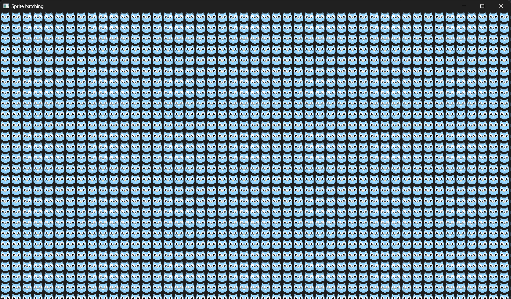

This example creates an SDL window and renderer, loads a texture from a .png file (using SDL_Image), and then draws it a multiple times using batched render call each frame.  
Sprite batching increases application performance, resulting in more FPS (frames per second).
  
The example is as minimalistic as possible, it:
 - uses axis aligned squares as a render targets for each of the sprites. It's possible to create different shapes within single batched render call.
 - uses single sprite to be drawn multiple times. It's possible to batch different sprites to be drawn with a single call as long as they are placed in the same texture ([texture atlas](https://en.wikipedia.org/wiki/Texture_atlas)).
 - doesn't modulate sprite size. It's possible for each of the sprites to have different size and aspect ratio.
 - doesn't modulate texture color. It's possible for each vertex of the drawn sprite to have color modulation applied.
 - implements simple performance metrics to display current FPS and frame time in console window.
  

Gopher sprites are available at https://github.com/egonelbre/gophers.

Windows:

